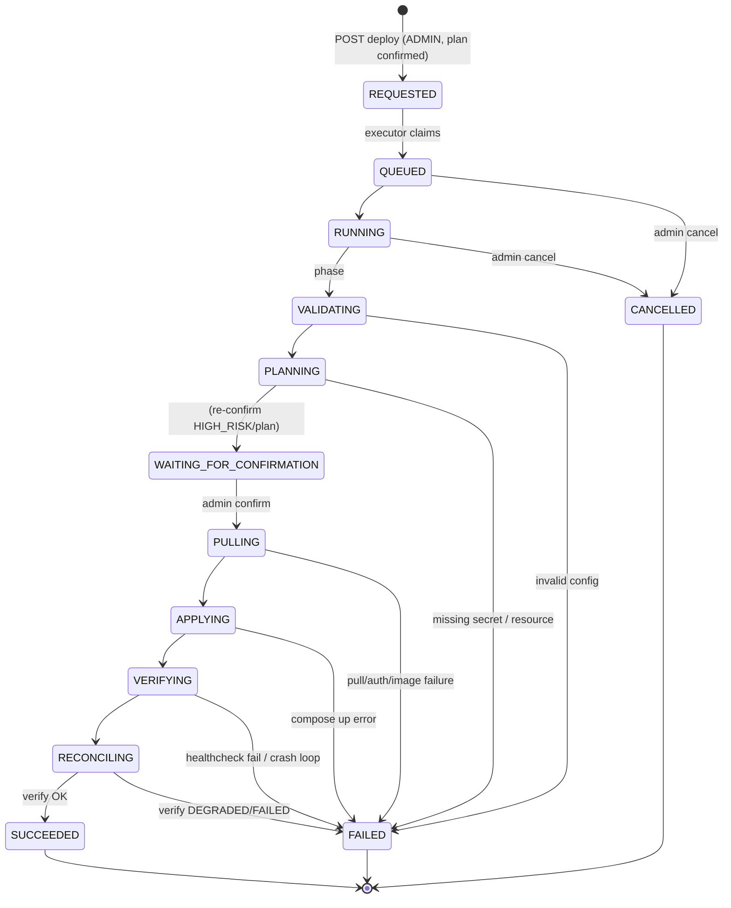
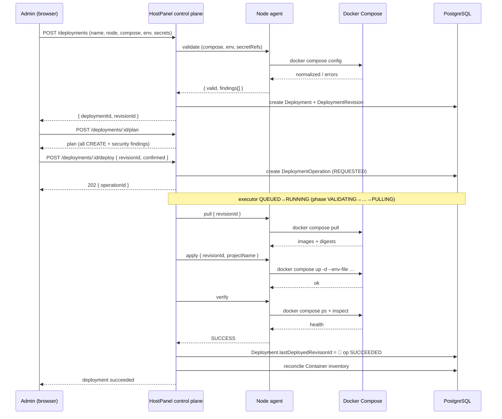
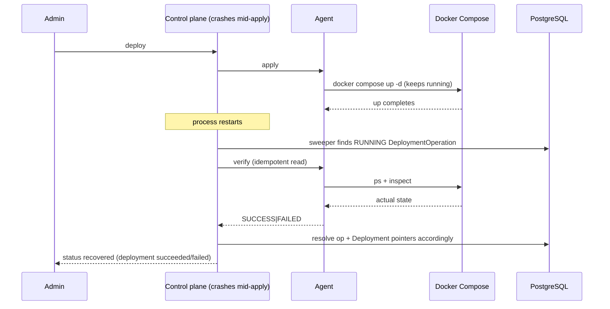
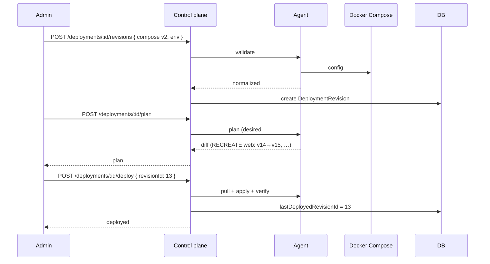

# HostPanel — Managed Compose Deployment Architecture

Status: **Design proposal (Phase 5). Not implemented.**
Scope: define how HostPanel will own the *deployment lifecycle* of Docker Compose workloads, without
confusing "observing a workload" with "owning its deployment definition".

This document is the anchor for the Phase 5 design package. Companion documents:

- `MANAGED-COMPOSE-DATA-MODEL.md` — proposed Prisma schema + migration implications.
- `MANAGED-COMPOSE-API.md` — proposed REST + agent contract.
- `MANAGED-COMPOSE-THREAT-MODEL.md` — deployment-specific threat model.
- `MANAGED-COMPOSE-IMPLEMENTATION-PLAN.md` — implementation phases + dependency order.
- `adr/0001…0008` — architecture decision records.

**Nothing in this document changes production behavior.** No migrations, no deployment endpoints, no
Compose mutation, no secrets in the DB, no Git credentials, no Docker workload changes.

---

## 1. Deployment ownership model

### 1.1 The core distinction

HostPanel must treat two things as permanently separate:

1. **Observing/operating a workload** — what HostPanel already does: inventory, inspect, logs,
   start/stop/restart, topology, reconciliation.
2. **Owning a deployment definition** — new: HostPanel stores a revisioned Compose definition and
   controls `pull` / `apply` / `verify` / `rollback`.

The current `Project.source` enum (`MANUAL | COMPOSE`) describes **membership semantics**, not
ownership:

- `MANUAL` = curated static membership (admin picks containers).
- `COMPOSE` = membership reconciled from `com.docker.compose.project` labels.

Both today are *observed*, never *owned*. Mailcow is `COMPOSE` and HostPanel must never start
overwriting its files or driving its lifecycle.

### 1.2 Recommended model: `Deployment` as a separate concept

Ownership is represented by a **new, optional, 1:1 `Deployment`** attached to a `Project`. The
presence of a `Deployment` row is the single source of truth for "HostPanel owns this lifecycle".
We deliberately **do not** add a third value to `Project.source` — the source enum keeps meaning
"how membership is derived," and ownership lives in a separate relation so the two can never drift.

```text
Project / Workload (the operational, user-facing object — UNCHANGED)
  source: MANUAL | COMPOSE            (membership semantics)
  composeProject: string?             (COMPOSE label)

  +-- optional Deployment (0..1)      <-- existence == lifecycle ownership
        source: HOSTPANEL | GIT
        activeRevisionId, lastDeployedRevisionId, …
        revisions: DeploymentRevision[]
```

### 1.3 The three modes (derived, not stored)

| Mode | `Project.source` | `Deployment` present? | HostPanel authority |
|---|---|---|---|
| **MANUAL** | `MANUAL` | no | observe + operate curated containers |
| **EXTERNAL_COMPOSE** | `COMPOSE` | no | discover + reconcile + inspect + operate; **never** deploy/modify the Compose definition |
| **MANAGED_COMPOSE** | `COMPOSE` | yes | owns definition, revisions, validation, pull, apply, verify, rollback |

The mode is **derived** at read time (`managed = project.deployment !== null`) and exposed in API/UI
views as `ownershipMode: "MANUAL" | "EXTERNAL_COMPOSE" | "MANAGED_COMPOSE"`. It is not stored
redundantly (avoids the classic "two fields that disagree" bug). This is the core decision — see
ADR-0001.

Note: a `MANAGED_COMPOSE` workload keeps `source = COMPOSE` because HostPanel's own `docker compose up`
produces containers carrying `com.docker.compose.project/service` labels, so the existing label
reconciliation continues to keep the `Container` inventory in sync (recreated containers get new
Docker IDs and are re-associated).

### 1.4 Answers to the specific questions

- **Should `Project` remain the workload abstraction?** Yes. It is the user-facing object and is
  stable across phases. It gains no new ownership fields.
- **Should a separate `Deployment` model exist?** Yes — 1:1 optional child of `Project`.
- **How does a Workload relate to a Deployment?** One `Project` may have zero or one `Deployment`
  (`Deployment.projectId` unique FK). One `Deployment` has many `DeploymentRevision`s.
- **Can MANUAL workloads have Deployments?** Not in v1. Creating a managed deployment implies a
  Compose definition, which implies label-derived membership; the create-deployment flow sets
  `source = COMPOSE`. (If a future "adopt a MANUAL workload and synthesize a Compose definition"
  feature is wanted, that is a distinct, separate conversion — not part of v1.)
- **Can EXTERNAL_COMPOSE be imported into MANAGED_COMPOSE?** Yes, deliberately — see §18 (managed
  import). Import creates a `Deployment` with an initial revision built from the discovered Compose
  definition, after explicit admin review + acknowledgment. `source` stays `COMPOSE`.
- **How is that conversion represented?** A `Deployment` row is created and attached; a
  `DeploymentRevision` #1 is recorded; an `AuditLog` event `DEPLOYMENT_IMPORT` captures the
  acknowledgment. Nothing in Docker changes during import itself.
- **How is lifecycle ownership revoked?** A managed workload can be **detached from management**:
  delete the `Deployment` (or soft-deactivate it), leaving the `Project` in place as an
  `EXTERNAL_COMPOSE` workload again. Detach is a pure DB operation (like the existing
  `detachComposeTracking`) — it never runs `docker compose down` or touches containers/volumes/
  networks. See §1.5.
- **Does detaching a managed workload return it to EXTERNAL_COMPOSE or MANUAL?** To
  `EXTERNAL_COMPOSE` (source stays `COMPOSE`, reconciliation resumes as label-mirroring). It does
  **not** become `MANUAL`; `MANUAL` is reserved for the existing `detachComposeTracking` path that
  stops label tracking entirely.
- **How do client grants behave through ownership changes?** `AccessGrant`s remain project-level and
  are untouched by any ownership transition (import, detach, deploy, rollback). Tenant access is
  resolved through grants, never through ownership mode. This mirrors the existing Phase 4 guarantee
  ("grants stay project-level so recreation never disturbs access").

### 1.5 Ownership revocation semantics

```text
MANAGED_COMPOSE ──detach management──▶ EXTERNAL_COMPOSE   (delete Deployment; keep Project + containers)
```

- Revisions/secret-version *history* is retained (soft-marked) or deleted per an explicit policy
  (v1: soft-deactivate `Deployment`; revisions are immutable and retained for audit). Secret
  values attached to the deployment are also retained until explicitly deleted (see §6).
- No `docker compose down`, no container stop, no volume/network removal — identical safety posture
  to the existing detach path.

---

## 2. Source-of-truth model

### 2.1 Two sources, one normalized artifact

```text
Deployment.source = HOSTPANEL | GIT        (GIT is future — see ADR-0008)
DeploymentRevision                          (immutable, normalized)
  composeDefinition      (normalized YAML)
  environmentSnapshot    (non-secret env, JSON)
  secretReferences       (keys only, never values)
  contentSha256
```

- **HOSTPANEL (v1)**: the admin authors the Compose definition in the UI/API; HostPanel stores it as
  an immutable revision.
- **GIT (future)**: `Deployment` references a repository/path/ref; a sync step fetches content and
  materializes it into a `DeploymentRevision`. Git is **not** required for v1 and **not** implemented.

### 2.2 The deployment engine is source-agnostic

The engine consumes only `DeploymentRevision`. Whether a revision originated from the UI, the API, or
(future) Git is irrelevant to plan/apply/verify/rollback. This is the abstraction that makes Git a
later, non-breaking addition (ADR-0008).

### 2.3 Where the source of truth lives

- **Authoritative revision content**: the control-plane database (Postgres), not the agent filesystem.
  The agent holds a *working copy* under its state dir (§7) that is re-materialized from the DB on
  demand. This guarantees revisions survive node/agent rebuilds and are consistent across the fleet.
- **Authoritative runtime state**: Docker itself (via the agent), reconciled into `Container` rows by
  the existing inventory reconciler.

---

## 3. Revision model

### 3.1 Immutability

`DeploymentRevision` is **immutable once created**. There is no UPDATE path on a revision's content.
Revisions are always created **validated** (the create flow runs `docker compose config` +
security analysis first; see §4, §9). "Draft" state is deliberately absent in v1 — if a definition
is invalid it never becomes a revision; the admin re-edits and re-validates.

### 3.2 Monotonic revision number

- `revisionNumber Int`, unique per deployment via `@@unique([deploymentId, revisionNumber])`.
- Allocated atomically on create (`max(revisionNumber)+1` under the deployment lock). It is
  human-facing (used in UI "deploy revision 12") and also the directory name (`000001`) on the agent.

### 3.3 Identity & dedup

- `contentSha256` = SHA-256 over the canonical form (normalized compose YAML + env snapshot + sorted
  secret-reference keys). Unique per deployment (`@@unique([deploymentId, contentSha256])`).
- **Identical revisions are deduplicated**: creating a revision whose canonical content matches an
  existing one returns the existing revision (idempotent), rather than minting a duplicate. This
  makes "save" and "redeploy the same config" converge.

### 3.4 What makes a revision "active"

Two distinct notions, kept explicitly separate:

- **`lastDeployedRevisionId`** — the last revision whose `apply` + `verify` reached `SUCCEEDED`
  (or `DEGRADED`). This is "active" in the *deployed* sense. Updated only after verification passes.
- **`desiredRevisionId`** — the revision an admin has *chosen* to deploy next (what the plan is
  computed against), even if it has not yet been applied. This is a user intent pointer, not a
  "current runtime" fact.

For v1 we store `lastDeployedRevisionId` (deployed) and compute "desired" from the most recent
validated revision or an explicit admin selection. We do **not** call a revision "active" merely
because it was saved.

### 3.5 Failed revisions

A "failed" revision is not a property of the immutable revision (its content is still correct);
failure is an outcome of an **attempt** recorded on `DeploymentOperation`. `Deployment` stores
`lastFailedRevisionId` for convenience. The revision row itself is never mutated to "failed".

### 3.6 Crash during deployment

If the control plane or agent crashes mid-apply, the `DeploymentOperation` is recovered by the sweeper
(§11). The revision rows involved are immutable and unchanged; the `Deployment.lastDeployedRevisionId`
is updated only after a successful post-restart `verify`. There is no partial-write of revision
content.

### 3.7 Fields carried by a revision

`revisionNumber`, `composeDefinition`, `environmentSnapshot`, `secretReferences[]` (keys),
`contentSha256`, `createdById` (nullable for future Git/system), `createdAt`, `deployNote?`,
`source` (HOSTPANEL|GIT), optional `sourceRef` (e.g. Git commit SHA, future).

---

## 4. Compose definition handling

### 4.1 v1 support surface (explicit)

- **Format**: Docker Compose Specification (the modern `compose.yaml`/`docker-compose.yml`), i.e.
  what `docker compose` v2 accepts. No legacy `version:` requirements; the field is ignored if
  present (Compose v2 does the same).
- **Parsing/normalization**: **do not parse YAML ourselves** for semantics. Use the official
  `docker compose` v2 CLI for validation + normalization via `docker compose config` (on the agent,
  §13–§14). The output of `config` is the canonical form stored in the revision.
- **Validation**: `docker compose config` reports syntax errors, interpolation errors, unknown keys,
  missing required env, invalid references. HostPanel wraps this into a structured
  `{ valid, errors, normalized }` result.
- **Normalization**: the *normalized* `config` output (not the raw author text) is what gets
  checksummed, planned, and applied. This means anchors/aliases, defaults, and interpolation are
  resolved *before* storage, so the revision is deterministic.

### 4.2 Explicitly supported in v1

- Multi-service definitions, `image`, `build` **not supported** (no builder — see below),
  `ports`, `volumes` (named + bind), `networks` (default + named), `environment`, `env_file`,
  `depends_on`, `restart`, `healthcheck`, `profiles` (accepted but only default-profile services are
  deployed unless `--profile` is exposed — v1: profiles are surfaced in the plan but the deploy uses
  the default/no explicit profile; documented limitation), `extends`/anchors/YAML aliases (resolved
  by `config`), `labels`, `logging`, `sysctls` (flagged in security analyzer), `tmpfs`.

### 4.3 Deferred (explicitly NOT in v1)

- `build:` (no image builder — deployment pulls images only).
- `include:` (Compose `include` fragments).
- Multiple `-f` overlay files (v1: single definition file).
- `secrets:`/`configs:` top-level sections (HostPanel has its own secret model, §6).
- `develop:`, `watch:`, `attach:`.
- Swarm/`deploy:` sections (out of scope entirely).

### 4.4 Relative paths, multiple files, interpolation

- **Relative paths** (bind mounts, `env_file` paths) resolve relative to the deployment's working
  directory on the agent (the revision dir). Path traversal is rejected by the security analyzer (§9)
  and the agent's path scoping (§7).
- **Multiple Compose files**: v1 supports exactly one definition file per revision.
- **Environment interpolation** (`${VAR}`, `${VAR:-default}`, `${VAR?err}`): the control plane
  resolves *known* variables (non-secret env + secret values) and passes them to `docker compose`
  via `--env-file`; unknown variables are surfaced as validation errors rather than silently
  defaulted (explicit > implicit).
- **Anchors/YAML aliases**: resolved by `config`; stored normalized.

### 4.5 HostPanel-authored vs imported

- HostPanel-authored definitions are stored verbatim in the revision (normalized copy alongside).
- Imported definitions (§18) are reviewed and normalized the same way.

---

## 5. Environment variables

### 5.1 Two categories

| Category | Example | Storage | Revisioned? | Redisplay? |
|---|---|---|---|---|
| **Non-secret config** | `APP_ENV`, `LOG_LEVEL` | `DeploymentRevision.environmentSnapshot` (JSON) | Yes — part of content hash | Yes |
| **Secret values** | `DB_PASSWORD`, `API_KEY` | `Secret` / `SecretVersion` (encrypted) | No — referenced, not embedded | No (masked) |

### 5.2 How Compose references values

Compose references env values by interpolation (`${VAR}`) or via the `environment:`/`env_file:`
mapping. HostPanel keeps the mapping: the Compose definition may use `${VAR}` placeholders, and at
deploy time HostPanel supplies the value from the revision env snapshot (non-secret) or from the
secret store (secret), resolved by the control plane and passed to the agent as an `--env-file`.

### 5.3 Where non-secret values live

`DeploymentRevision.environmentSnapshot` — a JSON map of `{ KEY: value }`. Values are **plaintext**
(they are non-secret), revisioned, and included in `contentSha256`.

### 5.4 Revisioning rules

- Changing a non-secret env value **creates a new revision** (it changes the normalized `config`
  output, hence the hash).
- Changing a secret **does not** create a revision (secrets are live, versioned separately — §6).
  A revision references a secret by key, not by value.

### 5.5 Reuse of env sets

v1: environment is a per-revision snapshot, **not** a separately-named reusable `EnvironmentSet`.
Reusability is deferred (a future `DeploymentEnvironment` set + `revision.environmentSetId` can be
added without changing the engine, which only ever consumes the snapshot). This avoids
over-normalization at the cost of re-entering shared values — acceptable for v1.

### 5.6 Precedence

Resolution precedence (highest first):
1. Secret value (explicitly marked secret in the deployment's secret reference mapping).
2. Non-secret env snapshot value.
3. `docker compose` `--env-file` values.
4. Compose interpolation defaults from the definition itself (`${VAR:-default}`).

HostPanel resolves steps 1–2 itself and emits a single effective `--env-file` to the agent, so the
agent never has to reason about precedence.

### 5.7 Diff display in plans

The plan shows env changes as add/change/remove per key, with **secret values redacted**
(`DB_PASSWORD: ●●● changed`). Non-secret values are shown to ADMIN; client roles never see env
contents (deployment details are ADMIN-scoped in v1 — §20).

---

## 6. Secrets architecture

### 6.1 Models

```text
Secret            (name/key, deploymentId, isActive, latestVersionId)
SecretVersion     (secretId, versionNumber, ciphertext, createdById, createdAt)
```

- Secrets are **deployment-scoped** (`Secret.deploymentId`), not global. This gives clean tenant
  isolation: a secret can never leak across deployments, and deletion/rotation are naturally bounded.
  A future global vault can be layered on without disturbing the per-deployment reference model.
- `SecretVersion.ciphertext` is AES-256-GCM-encrypted (§6.3). Plaintext is never stored.

### 6.2 How Compose references secrets

The Compose definition uses `${VAR}` interpolation for secret values exactly like non-secret env.
HostPanel knows a variable is a secret because it is in the deployment's `secretReferences` mapping
(which keys are secret), not because the value is present in the revision (it never is). The revision
stores only `secretReferences: string[]` (the keys), never values.

### 6.3 Encryption at rest

- Reuse the existing AES-256-GCM primitive, **parameterized by key name** (a small refactor of
  `server/security/crypto.ts`, which today hardcodes `NODE_CREDENTIALS_KEY`).
- Introduce a distinct master key `DEPLOYMENT_SECRETS_KEY` (64-hex, 32 bytes), supplied via
  environment only (root-owned `.env`, mode 600). **The master key never lives in the database.**
- Each `SecretVersion` uses a unique random 12-byte IV and GCM auth tag (identical mechanics to
  `Node.apiKeyEncrypted`).
- Key rotation of the *master key* is a re-encryption job (re-encrypt all `SecretVersion` rows under
  the new key) — designed as an explicit admin-triggered operation, not automatic; documented as a
  future operational runbook (mirrors the existing `NODE_CREDENTIALS_KEY` limitation).

### 6.4 Guarantees (hard requirements)

- Plaintext secrets never appear in `DeploymentRevision` (only keys).
- Plaintext secrets never appear in `AuditLog` (audit records `secret rotated to version N`, no value).
- Plaintext secrets never appear in logs — the agent masks secret values in compose output (§13) and
  the control plane never logs them.
- Existing stored values are **never redisplayed**: the API returns only `hasValue: true` + version
  metadata (createdAt, createdBy, versionNumber). There is no "show secret" endpoint.
- Creation/update/rotation is auditable and ADMIN-only.

### 6.5 Rotation, rollback interaction, deletion

- **Rotation** = create a new `SecretVersion` and advance `Secret.latestVersionId`. Old versions are
  retained (for audit and future explicit restore). Rotation does **not** create a new revision.
- **Rollback does NOT restore old secret values.** Rollback re-applies an old *configuration*
  revision, but secrets are always resolved to their **latest** version at apply time. This is the
  strong preference from the brief and is documented in the UI ("Secrets are not rolled back — the
  current secret value will be used"). See §16 and ADR-0006.
- **Deletion** = soft-disable (`Secret.isActive = false`); versions retained. A revision referencing a
  disabled secret cannot be planned/applied (validation/plan surfaces `missing_secret`). Hard delete
  is a separate explicit admin action (out of v1 scope; v1 = soft-disable only).
- **What happens when a revision references a deleted/disabled secret?** `validate` and `plan` fail
  with a structured `missing_secret { key, secretId }`; the admin must re-enable the secret, re-point
  the reference, or edit the definition. The deploy is blocked — HostPanel prefers to refuse.
- **Roles**: ADMIN only (create/update/rotate/delete). `CLIENT_ADMIN/OPERATOR/VIEWER` can never see
  values and, in v1, never see deployment details beyond status/history (§20).

---

## 7. Agent filesystem ownership

### 7.1 Configurable state directory

The agent resolves a writable base directory at startup and **reports it** in `/info`
(`stateDir`) plus a capability flag `deploymentsSupported: true|false`. Defaults:

- rootful Docker agent: `AGENT_STATE_DIR` or `/var/lib/hostpanel`
- rootless Docker agent: `AGENT_STATE_DIR` or `${XDG_DATA_HOME:-$HOME/.local/share}/hostpanel`

Rationale: `/var/lib/hostpanel` is **not writable in a rootless context**; the agent must not assume
it. The directory is always agent-configurable and the control plane treats it as opaque (the agent
owns its own path, mirroring how `DOCKER_HOST`/`XDG_RUNTIME_DIR` are already agent-local).

### 7.2 Layout

```text
<state-dir>/
  deployments/
    <deploymentId>/                 # deploymentId is a control-plane CUID; strict regex + realpath containment
      revisions/
        000001/
          compose.yml               # normalized compose definition (0600)
          env                        # non-secret env file (0600)
        000002/
          compose.yml
          env
      current/                      # symlink → revisions/0000NN (atomic switch target)
```

- **Secrets are not persisted** in the tree. At apply time the agent writes a transient `.secrets.env`
  (mode 0600, in a private tmpdir or the revision dir with immediate deletion) used only for the
  `--env-file` argument, then unlinks it.
- **Permissions**: dirs `0700`, files `0600`. Never world-readable.

### 7.3 Safety guarantees

- HostPanel-managed files live **only** under `<state-dir>/deployments/<deploymentId>/`. The agent
  resolves any path against this prefix with `path.resolve` + a `startsWith(prefix)` containment
  check and rejects traversal (`..`, absolute paths, symlink escapes).
- **Externally managed Compose directories are never touched** — the agent never reads/writes outside
  its own state dir for deployment purposes. (The only future exception is read-only import of a
  discovered config file, §18, which is separately gated.)
- **Atomic switching**: write revision dir fully → `fsync` → atomically repoint `current` symlink via
  `rename()` of a temp symlink. Compose is always invoked against `current/`.
- **Cleanup**: revision dirs are retained for rollback; a retention policy (keep last N, default
  e.g. 20) prunes old dirs after they age out of rollback range — designed, not auto-enforced in v1.

### 7.4 Rootless vs rootful

Both work because the agent runs as the target user and owns its own state dir. The rootless adapter
already forwards `DOCKER_HOST`/`XDG_RUNTIME_DIR`; compose is spawned with the same env so it talks to
the same daemon the agent uses.

---

## 8. Deployment plan / diff

### 8.1 Inputs

1. **Desired model** — `docker compose -f current/compose.yml --env-file current/env config` output
   (normalized), or the normalized model already stored in the revision.
2. **Current model** — live runtime state from `docker compose ps` + `docker inspect` (via the
   existing inventory + targeted inspect), plus the last-deployed revision if known.

### 8.2 What HostPanel computes vs what Compose guarantees

- HostPanel computes a **prediction** of changes: per-service `CREATE | RECREATE | UNCHANGED |
  REMOVE`, and network/volume `CREATE | CHANGE | UNCHANGED` (never `REMOVE` — see §10).
- Compose's own `up` is the **authority** on what actually happens; it re-hashes the config and
  recreates services it considers changed. If the installed Compose supports `docker compose up
  --dry-run`, HostPanel uses that as the primary signal; otherwise it falls back to its own diff and
  **labels the plan as "predicted"**, not guaranteed.

### 8.3 Diff detail

Per service, report changes on: image (tag→tag, and optionally resolved digest), environment
(add/change/remove, secrets masked), ports, volumes, networks, restart policy, healthcheck,
depends_on, labels. Image digest differences are shown when the digest is resolvable locally
(`docker image inspect`) or recorded from a prior deploy.

### 8.4 Uncertainty is explicit

- `UNKNOWN`/`MAY_CHANGE` is a legitimate per-service verdict when HostPanel cannot determine whether
  Compose will recreate (e.g. `build` contexts — not in v1 — or opaque `extends` resolution edge
  cases). The plan never overclaims.
- The plan summary is human-shaped:

```text
Deploy revision 12?
  2 containers will be recreated
  1 container will be created
  3 containers are unchanged
  No persistent volumes will be removed.
  No networks will be removed.
```

### 8.5 Recreation determination

A service is `RECREATE` when its normalized config hash differs from the last-applied config hash for
that service (HostPanel stores per-service config hashes in the applied-revision snapshot), or when
Compose's `--dry-run`/config comparison says so. HostPanel records the applied per-service hash at
deploy time so subsequent diffs are deterministic.

---

## 9. Safety / privilege analyzer

### 9.1 What it detects

`privileged`, Docker socket mounts (`/var/run/docker.sock`, `/run/docker.sock`, rootless equivalents),
host filesystem bind mounts (esp. sensitive paths `/`, `/etc`, `/root`, `~/.ssh`, `/home`),
`network_mode: host`, `devices`, `cap_add`, `pid: host`, `ipc: host`, port publishing (esp.
low/privileged ports and `0.0.0.0`), sensitive filesystem paths, `external` networks/volumes,
`security_opt` overrides (e.g. `seccomp:unconfined`, `apparmor:unconfined`), custom DNS overrides,
`sysctls`, `read_only: false` on host mounts.

### 9.2 Severity levels

| Level | Meaning | Default action |
|---|---|---|
| `INFO` | Informational (e.g. port publishing) | shown in plan, no block |
| `WARNING` | Worth attention (e.g. `cap_add: NET_ADMIN`, high port) | shown, no block |
| `HIGH_RISK` | Dangerous (e.g. docker.sock mount, `privileged`, host `/etc` bind) | **requires explicit ADMIN acknowledgment** before a revision can be created |
| `BLOCKED` | Not permitted (e.g. `pid: host` + `privileged` combos, or anything HostPanel refuses) | **refused** at validation; cannot be acknowledged in v1 |

### 9.3 Policy behavior (v1)

- `BLOCKED` constructs are refused at validation — no revision is created; the admin sees the finding
  and edits the definition.
- `HIGH_RISK` constructs require the admin to acknowledge them at revision-create time; the
  acknowledgment is persisted on the revision (`acknowledgedFindings[]`) and audited. Deploying a
  `HIGH_RISK` revision without acknowledgment is refused.
- `WARNING`/`INFO` are surfaced in the plan; no acknowledgment needed.

### 9.4 RBAC

Only **ADMIN** can author/validate/acknowledge/deploy definitions. `CLIENT_ADMIN`, `CLIENT_OPERATOR`,
`CLIENT_VIEWER` have **no deployment-authoring capability** at all (ADR-0007). Client users cannot
submit a Compose definition, cannot acknowledge findings, cannot deploy.

---

## 10. Shared-resource safety

Reuses the Phase 4 shared network/volume detection (`workload-resources.ts`). Rules:

- **Persistent volumes are never automatically deleted** during deploy/update/rollback. Period.
  There is no code path in v1 that removes a named volume.
- **Networks are not automatically deleted either.** `docker compose up` (without `down`) does not
  remove networks; HostPanel invokes `up -d` only, never `down` with removal, and never `network rm`.
- **External volumes/networks** (declared `external: true`) are read-only references: never created,
  never removed, flagged in the plan as "external — not managed."
- **Shared volumes/networks** (used by containers outside the workload): never removed, and the plan
  explicitly warns when a change could affect them (e.g. a recreate that reattaches a shared network
  is safe, but is called out).
- **Volumes mounted outside this workload**: treated as shared; never removed.
- **Orphan containers** (running under the project name but not in the definition): reported in the
  plan; **not** removed (v1 does not pass `--remove-orphans`).
- **Renamed Compose resources**: treated as remove-old + create-new by Compose; HostPanel surfaces
  the implied `REMOVE` (container) / `CHANGE` (network) but still never deletes volumes.

**v1 stance**: HostPanel will say *"I cannot safely perform this automatically"* before it deletes
any persistent volume or shared resource. Destructive resource removal is a future, explicitly
admin-triggered, separately-designed feature — not part of the deploy/rollback path.

---

## 11. Deployment state machine

### 11.1 Where state lives

| Concern | Location |
|---|---|
| **Transitional** state of one action (validate/plan/pull/apply/verify/rollback) | `DeploymentOperation` (new) |
| **Durable** state of the deployment | `Deployment` (`lastDeployedRevisionId`, `lastFailedRevisionId`, `lastDeployState`, `lastOperationId`) |
| **Revision** content | `DeploymentRevision` (immutable) |

We introduce a **`DeploymentOperation`** model rather than overloading the existing container-centric
`Operation` (which requires `dockerContainerId` and enforces a per-container active-op unique index).
See §12 and DATA-MODEL.

### 11.2 States

`DeploymentOperation.state` (outer lifecycle, mirroring existing `OperationState`):

```text
REQUESTED → QUEUED → RUNNING → SUCCEEDED | FAILED | CANCELLED
```

`DeploymentOperation.phase` (inner stage, only meaningful while `RUNNING`), for `DEPLOY`:

```text
VALIDATING → PLANNING → WAITING_FOR_CONFIRMATION → PULLING → APPLYING → VERIFYING → RECONCILING → SUCCEEDED
```

For `ROLLBACK`: `PLANNING → PULLING → APPLYING → VERIFYING → RECONCILING → SUCCEEDED`.
`VALIDATE` and `PLAN` are synchronous read-only and do **not** create a `DeploymentOperation`
(they are plain API calls returning results); only `DEPLOY` and `ROLLBACK` are asynchronous operations.

`Deployment.lastDeployState ∈ { PENDING, SUCCEEDED, DEGRADED, FAILED, ROLLED_BACK, ROLLBACK_FAILED }`.

### 11.3 State diagram



For rollback, `WAITING_FOR_CONFIRMATION` is skipped only if the plan is pre-confirmed; otherwise the
same confirmation gate applies.

### 11.4 Restart / disconnect recovery

- **Control-plane restart**: the existing sweeper (extended to also sweep `DeploymentOperation`)
  finds `RUNNING` deployment ops and runs **idempotent recovery** — it does *not* blindly re-run
  `apply`; it re-runs `verify` (read-only, idempotent) to learn the true state. If verify says the
  desired revision is actually healthy, the op is marked `SUCCEEDED` and `Deployment.lastDeployedRevisionId`
  updated; otherwise `FAILED` with `error = "interrupted during deploy"`.
- **Agent restart**: the agent is stateless for deployments (Docker holds runtime truth; state dir is
  on disk). On reconnect, control plane re-runs `verify`/`reconcile`. `docker compose up -d` is
  **convergent** — re-running it reaches the desired state; it is not assumed idempotent but is safe
  to converge.
- **Connection drop mid-apply**: `docker compose` keeps running (child process) or dies with the
  agent; the control plane treats the op as indeterminate until `verify` resolves it. No automatic
  rollback on disconnect — only verification.
- **Stale RUNNING ops**: swept to terminal via `verify` (idempotent), never via a destructive retry.

### 11.5 Idempotency

- Idempotent: `validate`, `plan`, `verify`, `reconcile` (all reads).
- Convergent (safe to re-run): `pull`, `apply` (`docker compose up -d`).
- Retries: failed `pull`/`apply` are retryable by admin; the retry creates a new `DeploymentOperation`
  (terminal ops are never "resumed" in place).

---

## 12. Concurrency and locking

### 12.1 Lock scope

A **deployment-level operation lock**: at most one non-terminal `DeploymentOperation` per
`Deployment` (partial unique index `@@unique([deploymentId]) WHERE state IN (REQUESTED, QUEUED, RUNNING)`).

Additionally, a deploy/rollback must not race with container-level `start/stop/restart` on members of
the same workload:

- Requesting a `CONTAINER_*` operation on a container whose workload has an active
  `DeploymentOperation` → `409` conflict.
- Requesting a `DEPLOY`/`ROLLBACK` while any member container has an active `CONTAINER_*` operation →
  `409` conflict.

### 12.2 Behavior

- **Lock timeout**: the lock is the DB row itself (no separate lock table). A `DeploymentOperation`
  stuck in `RUNNING` beyond a configurable `DEPLOYMENT_OP_TIMEOUT_MS` (default e.g. 10 min) is swept
  by the recovery pass (§11.4) into `FAILED`/`SUCCEEDED`, releasing the lock.
- **Stale lock**: resolved by the sweeper (verify-based) on control-plane restart and periodically.
- **Control-plane restart**: the partial unique index + sweeper guarantee at most one active op
  survives; on restart the sweeper resolves it before new ops are accepted.
- **Agent restart**: the lock is held control-plane-side (DB), not agent-side, so an agent restart
  doesn't release it — recovery via `verify` as above.
- **Admin cancellation**: `POST .../cancel` transitions `QUEUED`/`RUNNING` → `CANCELLED`; the control
  plane tells the agent to abort the compose child (SIGTERM). Cancellation is best-effort (compose may
  have already committed a container change); `verify` reconciles the actual state afterward.

The DB is authoritative; browser UI state is never relied upon for mutual exclusion.

---

## 13. Agent deployment API (curated contract)

The agent gains a **narrowly scoped** deployment surface. No arbitrary shell, no arbitrary Docker
API, no arbitrary filesystem access. Every action is scoped to a HostPanel `deploymentId`, validated
against the agent-owned deployment directory.

| Action | Endpoint | Notes |
|---|---|---|
| Validate | `POST /deployments/:deploymentId/validate` | body: `{ compose, env, secretRefs, secretValues? }` → `{ valid, errors[], normalized?, findings[] }` |
| Inspect state | `GET /deployments/:deploymentId/state` | current materialized revision + last-apply metadata |
| Plan | `POST /deployments/:deploymentId/plan` | body: `{ revisionId }` → diff plan |
| Pull | `POST /deployments/:deploymentId/pull` | body: `{ revisionId }` → pull result (images + digests) |
| Apply | `POST /deployments/:deploymentId/apply` | body: `{ revisionId, projectName }` → apply result |
| Verify | `POST /deployments/:deploymentId/verify` | body: `{}` → `{ SUCCESS|DEGRADED|FAILED, detail }` |
| Rollback | `POST /deployments/:deploymentId/rollback` | body: `{ revisionId }` → same as apply |
| List revisions | `GET /deployments/:deploymentId/revisions` | materialized revision dirs (for reconciliation) |

Full request/response schemas in `MANAGED-COMPOSE-API.md`.

**Hard constraints:**

- The control plane can **never** tell the agent "run this arbitrary command." The agent only ever
  invokes a fixed, allow-listed compose subcommand (`config`, `pull`, `up -d`, `ps`) with args
  assembled from typed, validated fields.
- `deploymentId` is validated by strict regex and by resolving it inside
  `<state-dir>/deployments/` with realpath containment (reject `..`, symlink escape, absolute
  paths).
- Compose output is captured and **secret-masked** before being returned (the agent knows which
  values are secret because the request marks them, or it masks any value it injected from
  `secretValues`).

### 13.1 How revision content reaches the agent

The control plane is the source of truth. For each operation it sends the revision payload
(`compose` + non-secret `env` + `secretValues` for apply/validate). The agent materializes files in
its state dir. `secretValues` are held in memory / a 0600 temp file and never persisted. On agent
restart the control plane re-pushes as needed. **Secret values cross the control-plane→agent channel
only over the authenticated `x-agent-key` link; for remote nodes this requires TLS (see THREAT-MODEL,
§24 and SECURITY-REVIEW §8) — a stated precondition before remote managed deployments ship.**

---

## 14. `docker compose` execution model

- **Use the official Docker Compose v2 CLI/plugin** via `spawn("docker", ["compose", ...])` with the
  same argument-array, never-shell discipline as the existing rootless adapter. **Do not reimplement
  Compose orchestration** (no custom reconciliation of services, no hand-rolled up semantics).
- **Availability detection**: `docker compose version` at agent startup; agent reports
  `composeSupported` + version in `/info`. If absent, deployment endpoints return
  `COMPOSE_UNAVAILABLE`.
- **Minimum version**: v2.20+ (for reliable `--dry-run` and `--env-file` behavior). Older versions
  degrade to HostPanel's own diff (plan marked "predicted").
- **Project naming**: `-p <composeProjectName>` (stored on `Deployment`), consistent with the
  workload's `Project.composeProject` so labels match the existing reconciliation.
- **Pull**: `docker compose pull` (with `--ignore-pull-failures` never used — failures surface).
  Pull policy `ALWAYS` for mutable tags, `IF_NOT_PRESENT` for digests (v1).
- **Apply**: `docker compose up -d` (no `--remove-orphans` in v1 — conservative). `--env-file` for
  resolved env + secrets. `--quiet-pull` off; output captured.
- **Recreate semantics**: Compose's own (config-hash-based). HostPanel does not force
  `--force-recreate` unless the admin explicitly requests it on the deploy.
- **Orphans**: left in place (reported, not removed).
- **Output capture / exit codes**: stdout+stderr captured; non-zero exit → `FAILED` with a
  sanitized, secret-masked message. Per-phase timeout (configurable, default e.g. pull 5 min,
  up 5 min, verify 60s) via `AbortController`/child kill.
- **No execution happens during this design phase.**

---

## 15. Health verification

`docker compose up` success ≠ healthy. Post-apply `verify`:

1. `docker compose ps` + `docker inspect` for each service → running state, restart count, healthcheck
   status (the agent already captures these).
2. **Grace period**: wait a configurable `DEPLOYMENT_VERIFY_GRACE_MS` (default 30s), poll healthchecks.
3. **Verdicts**:
   - `SUCCESS` — all services running; healthchecks (where defined) healthy.
   - `DEGRADED` — some service unhealthy/stopped, or a healthcheck is failing, but the deployment
     applied (containers exist in the desired config).
   - `FAILED` — crash loop (restart count ≥ threshold), healthcheck failed after grace, or containers
     failed to start.
4. Containers with **no healthcheck**: `running` ⇒ `SUCCESS` (with an explicit "no healthcheck —
   verified by running state only" note).

**Automatic rollback: none.** On `DEGRADED`/`FAILED` HostPanel **detects, reports, and offers
admin-triggered rollback** — it never rolls back automatically in v1 (no implicit policy). Automatic
rollback would require an explicit per-deployment policy, which is deferred.

---

## 16. Rollback semantics

Rollback = **re-apply a previously successful revision** (`Deployment.lastDeployedRevisionId` or an
admin-selected earlier revision). It is a configuration rollback, not a data rollback.

**It does NOT:**

- restore database records inside applications,
- restore volume contents,
- reverse app-level DB migrations,
- restore deleted external resources,
- restore old secret values (secrets always resolve to latest version).

UI copy:

```text
Rollback to revision 11?
HostPanel will restore the previous container configuration.
Persistent volume data will NOT be restored.
Application/database migrations will NOT be reversed.
Secret values will NOT be rolled back — current values are used.
```

Edge cases:

| Situation | Behavior |
|---|---|
| Previous image tag no longer resolves | `pull` fails → `FAILED` with clear message; if a digest was recorded, HostPanel offers pull-by-digest fallback (see §17) |
| Digest unavailable | fall back to tag; flag as "could not verify image identity" |
| Secret value changed since old revision | latest secret value used (not rolled back) |
| External network disappeared | `up` fails → `FAILED` with clear message (external resource missing) |
| Old host bind path no longer exists | `up` fails → `FAILED` naming the missing path |

See ADR-0006.

---

## 17. Image identity and update behavior

- Revisions reference images by **reference** (`image: myapp:v14` or `image: myapp@sha256:…`).
- During deploy, HostPanel resolves **tag → digest** (`docker image inspect` post-pull, or the
  registry digest via `docker manifest inspect` — v1 uses local inspect after pull). The **deployed
  digest is recorded** in a per-deploy snapshot (`DeploymentRevisionImage` or
  `Deployment.lastDeployedImageDigests`), so "current vs desired" and rollback-by-digest are possible.
- **Mutable tags** are re-resolved on every deploy. **Immutable digests** are pinned.
- **Pull policy**: `ALWAYS` for tags (v1 default), `IF_NOT_PRESENT` for digests.
- **Current vs desired** is shown in the plan (tag diff, and digest diff when both are known).
- **Private registries**: deferred. The boundary is designed as a future `RegistryCredential`
  reference on `Deployment` (or node-scoped), consumed by the agent's pull step — no credential
  storage is implemented in v1. No registry manager, no image builder.

---

## 18. Managed import / take ownership (future — designed, not implemented)

```text
External Compose workload → Take ownership → Import current Compose definition → Review → Create managed Deployment revision 1
```

- **Obtaining the Compose source**: Compose v2 records the project's config-file path in container
  labels (`com.docker.compose.project.config_files`, `com.docker.compose.project.working_dir`, and
  `env_file` when present). The agent reads those labels (read-only) and, **only for a path the admin
  has explicitly confirmed is within an allow-listed directory**, reads the file content and returns
  it for review.
- **Readability of arbitrary external paths**: restricted. The agent only reads paths the control
  plane explicitly designates for import, and the admin must confirm the path. No arbitrary
  filesystem read is exposed.
- **Env files**: imported where a `.env`/`env_file` label exists; non-secret values become the
  initial env snapshot. Values the admin marks secret are **not** auto-imported from the file into
  the secret store; the admin re-enters secret values via the secret UI (nothing is silently
  classified).
- **Secrets**: never auto-extracted from files; the admin must explicitly create/import secrets.
- **What can/cannot be auto-imported**: a static compose definition + non-secret env can be imported;
  secrets, `build` contexts, and `include` fragments cannot and are reported.
- **Unsupported constructs**: reported in the review step; import is blocked or proceeds-with-warnings
  at the admin's explicit choice.
- **Acknowledgment**: the admin explicitly acknowledges ownership transfer in the UI; this produces
  an audited `DEPLOYMENT_IMPORT` event and revision #1. Until acknowledged, nothing is created.

**Mailcow remains EXTERNAL_COMPOSE unless deliberately imported later.** This workflow is **not
implemented** in Phase 5 and is scheduled after the core engine (see IMPLEMENTATION-PLAN).

---

## 19. Create-new deployment workflow (UI design)

### 19.1 Create workload entry points

1. Existing Docker workload (MANUAL) — current path.
2. Compose discovery / adopt (EXTERNAL_COMPOSE) — current path.
3. **New managed Compose workload** — new.

### 19.2 Managed flow

1. **Name + node** (workload name, slug, target node).
2. **Compose definition** (paste/author YAML).
3. **Environment** (non-secret key/values; mark which are secrets).
4. **Secrets** (create/assign secret values for marked keys).
5. **Validation** (`docker compose config` + security analyzer).
6. **Security warnings** (acknowledge HIGH_RISK; BLOCKED stops here).
7. **Plan** (diff preview — first deploy = all `CREATE`).
8. **Deploy** (async operation with live phase progress).

### 19.3 Workload detail — Deployments tab

The managed workload detail gains a **Deployments** tab (only when `managed`):

- active revision + `lastDeployState` badge,
- revision history (number, author, timestamp, note, content hash),
- deployment status + latest operation phase,
- image changes (tag/digest),
- rollback action (with the §16 explanation dialog),
- "view definition / view diff" (definition shown to ADMIN only; diff between revisions),
- who deployed + timestamp.

Overview/Containers/Networks/Volumes/Activity tabs unchanged; the deployment definition is
**not** shown to client roles.

---

## 20. Authorization model

Add deployment capabilities to `server/auth/policy.ts`:

```
deployment.view      — see managed deployment status/history
deployment.manage    — author/edit definitions, create revisions, secrets
deployment.deploy    — deploy / rollback / pull / plan-confirm
```

Role matrix (v1):

| Capability | ADMIN | CLIENT_ADMIN | CLIENT_OPERATOR | CLIENT_VIEWER |
|---|---|---|---|---|
| `deployment.view` | ✅ | ✅ (only granted workloads) | ✅ (only granted) | ✅ (only granted) |
| `deployment.manage` | ✅ | ❌ | ❌ | ❌ |
| `deployment.deploy` | ✅ | ❌ | ❌ | ❌ |
| secret create/update/rotate/delete | ✅ | ❌ | ❌ | ❌ |
| import / take ownership | ✅ | ❌ | ❌ | ❌ |

- `deployment.view` for client roles is additionally scoped by an active `AccessGrant` on the
  workload (the existing project grant). Without a grant, a client role has no visibility even with
  the capability (defense in depth — capability + grant).
- `deployment.manage`/`deploy` are **ADMIN-only by construction** (mirroring `node.manage`).
- Client roles can still perform their existing permitted container ops (`start/stop/restart/view_logs`)
  on a managed workload's containers via grants — deployment ownership does not remove operational
  grants. (In practice an admin would usually not grant restart on a managed workload's containers,
  but the model permits it and does not silently revoke it.)

Security wins over convenience: no client role can author a Compose definition, submit secrets,
acknowledge HIGH_RISK findings, or trigger a deploy.

---

## 21. Git integration boundary (designed, not implemented)

```text
Deployment.source = HOSTPANEL | GIT
DeploymentGitConfig (future): repository, ref (branch/tag/SHA), composeFilePath, environmentMapping?
```

- A `GIT` deployment references repo/ref/path; a sync step fetches content and materializes an
  immutable `DeploymentRevision` (source=GIT, sourceRef=commit SHA).
- The engine is source-agnostic — plan/apply/verify/rollback consume only `DeploymentRevision`.
- No Git credentials are stored; credential handling is an explicit future design (secret-bound,
  scoped to a deployment or node).
- No GitOps reconciliation loop, no auto-sync in v1 or Phase 6.

---

## 22. Backup implications

Deployment rollback is **configuration rollback, not data rollback**. The boundary is explicit:

- Rollback never touches volume contents or app DBs.
- Future: a loose `WorkloadBackupState` (or a JSON `backupMetadata` field on `Project`/`Deployment`)
  can record `{ persistentDataPresent: bool, backupProtection: "unknown" | "protected" | "unprotected" }`
  and optionally integrate with an external backup vendor.
- This is a **metadata attachment**, not a coupling of the deployment engine to any backup system.
  No backup engine is built now.

UI placeholder for the future: "Persistent data present — Backup protection: unknown."

---

## 23. Failure scenarios

| Scenario | Detected by | Operation final state | UI message | Retry | Recovery |
|---|---|---|---|---|---|
| Invalid Compose YAML | `docker compose config` (validate) | — (no op created) | structured field errors | re-edit | admin fixes definition |
| Unsupported Compose option | security analyzer / `config` | — (validate) | finding detail | re-edit | admin removes construct |
| Missing secret | plan (reference resolution) | `FAILED` | `missing_secret {key}` | re-point/re-enable | admin re-enables or re-points |
| Node offline before deploy | agent unreachable | `FAILED` | "node offline" | after node returns | re-request deploy |
| Node drops during pull | timeout | `FAILED` | "connection lost during pull" | retry pull | re-run deploy (convergent) |
| Docker daemon unavailable | agent health / compose error | `FAILED` | "docker daemon unavailable" | after daemon returns | re-run |
| Image pull auth failure | pull exit code | `FAILED` | "authentication failed" (sanitized) | fix creds | re-run (creds deferred) |
| Image not found | pull exit code | `FAILED` | "image not found: <ref>" | fix tag | re-run |
| Disk full | pull/up exit code | `FAILED` | "no space left" | free space | re-run |
| Port conflict | `up` exit code | `FAILED` | "port already in use: <p>" | resolve conflict | re-run |
| Bind source missing | `up` exit code | `FAILED` | "bind source missing: <path>" | create path | re-run |
| External network missing | `up` exit code | `FAILED` | "external network missing" | restore network | re-run |
| Healthcheck fails | verify | `DEGRADED`/`FAILED` | "healthcheck failing: <service>" | admin rollback | offer rollback |
| Crash loops | verify (restart count) | `FAILED` | "crash loop: <service>" | admin rollback | offer rollback |
| Control-plane restart mid-deploy | sweeper | resolved by verify | (resolved silently or surfaced) | — | verify-based recovery |
| Agent restart mid-deploy | reconnect + verify | resolved | as above | — | verify-based recovery |
| DB unavailable mid-deploy | op write fails | op stuck → sweeper | "interrupted" | after DB returns | sweeper resolves via verify |
| Revision changed while another deploy runs | deployment lock | `409` conflict | "a deployment is in progress" | wait | lock release |
| Rollback fails | rollback op | `ROLLBACK_FAILED` | "rollback failed: <reason>" | re-attempt | re-run rollback |
| Reconciliation disagrees with result | reconcile drift check | `SUCCEEDED` (drift flagged) | "drift detected: <services>" | admin reviews | surface drift, no auto-fix |

---

## 24. Threat model

See `MANAGED-COMPOSE-THREAT-MODEL.md` for the full table. Highlights: malicious Compose definition,
privileged-container escape, docker.sock mount, host filesystem overwrite, arbitrary image execution,
secret exfiltration, command injection, path traversal, symlink attacks, agent deployment-dir escape,
cross-tenant access, forged/replayed deployment ops, compromised agent/control plane, leaked Git
credentials (future), secret exposure in compose output, and malicious YAML/parser behavior.

---

## 25. Proposed database schema

See `MANAGED-COMPOSE-DATA-MODEL.md` for the full Prisma proposal, keys, constraints, deletion
behavior, indexes, and migration implications from the current production schema.

---

## 26. Proposed API surface

See `MANAGED-COMPOSE-API.md` for REST routes, agent endpoints, request/response payloads,
authorization, idempotency, and audit events.

---

## 27. Sequence diagrams

### 27.1 New deployment



### 27.2 Failed deployment → admin rollback

```mermaid
sequenceDiagram
    participant A as Admin
    participant CP as Control plane
    participant AG as Agent
    participant DC as Docker Compose
    participant DB as PostgreSQL

    A->>CP: POST /deployments/:id/deploy { revisionId: 12 }
    CP->>AG: apply #12
    AG->>DC: docker compose up -d
    DC-->>AG: up ok (but app crashes)
    CP->>AG: verify
    AG-->>CP: FAILED (crash loop)
    CP->>DB: op FAILED; Deployment.lastFailedRevisionId=12
    CP-->>A: deployment failed (offer rollback)
    A->>CP: POST /deployments/:id/rollback { revisionId: 11 }
    CP->>AG: apply #11 (previous successful)
    AG->>DC: docker compose up -d
    DC-->>AG: ok
    CP->>AG: verify → SUCCESS
    CP->>DB: op SUCCEEDED; Deployment.lastDeployedRevisionId=11
    CP-->>A: rolled back to revision 11
```

### 27.3 Control-plane disconnect during deployment



### 27.4 Managed revision update (diff + deploy)



---

## 28. ADRs

See `adr/0001…0008`.

---

## 29. Implementation staging

See `MANAGED-COMPOSE-IMPLEMENTATION-PLAN.md` (recommended dependency order; secrets are
foundational in Phase 6A, deployment execution in 6B, rollback + UI in 6C, Git + import deferred).

---

## Design principles (restated for this package)

1. **Safety** — refuse before guessing; never auto-delete volumes/network; never auto-rollback.
2. **Explicit ownership** — `Deployment` presence is the sole ownership signal; derived mode, never
   a redundant stored enum.
3. **Predictable recovery** — immutable revisions + verify-based sweeper recovery; DB is authoritative.
4. **Auditability** — every ownership transition, revision, secret rotation, and deploy is an audit
   event; secrets never logged.
5. **Tenant isolation** — secrets and deployments are deployment-scoped; client roles can never
   author or deploy; grants remain the access boundary.
6. **Operational clarity** — human-readable plans and state machines.
7. **Maintainability** — official Compose v2, source-agnostic engine, minimal over-normalization.
